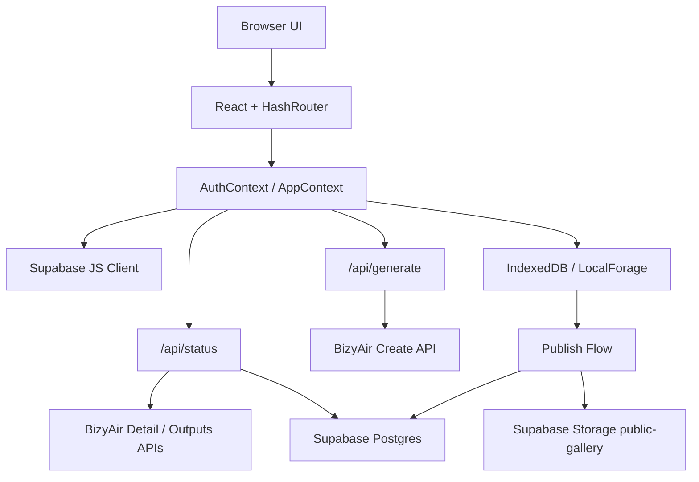

# Dopagen AI

An AI image generation web app built with React, Vite, Supabase, BizyAir, and Vercel-style serverless APIs.

This README is intentionally long and maintenance-oriented. It is the canonical onboarding and modification guide for this repository. If you are about to change behavior, fix a bug, migrate infrastructure, or hand the project to another developer, read this file first.

## 1. Project Summary

Dopagen AI is a browser-first image generation product with three major user-facing surfaces:

1. Public/home experience
   - The homepage combines the generation workspace and a lazily loaded public community feed.
2. User workspace
   - Logged-in users can generate images, store local drafts, publish selected works to a public gallery, and manage their own history.
3. Admin console
   - Admins can configure globally available models and editable site settings directly from the frontend.

The current implementation optimizes for:

- Fast perceived image generation
- Local-first history persistence
- Low backend complexity
- Vercel-friendly deployment
- Minimal moving parts during local development

The app currently uses:

- BizyAir as the image generation engine
- Supabase for auth, database, and storage
- IndexedDB via LocalForage for local image persistence
- Vite for frontend build/dev
- Vercel-compatible API handlers under `/api`

## 2. Current Architecture At A Glance

### 2.1 Runtime Overview



### 2.2 Key Design Decisions

- Generation is not performed directly from the browser to BizyAir.
  - The browser calls local/Vercel API handlers in `/api`.
- Task status is polled asynchronously.
  - The frontend stores a local task and uses BizyAir `requestId` for polling.
- Generated drafts are stored locally first.
  - Full-resolution generated images are downloaded and saved into IndexedDB before any publish step.
- Publishing is explicit and separate from generation.
  - Only when the user publishes does the app upload a compressed version to Supabase Storage and create an `images` record.
- Admin management currently writes directly to Supabase from the browser.
  - This is convenient but not the most secure design. More on that in the security section.

## 3. Tech Stack

### Frontend

- React 19
- React Router 7
- Vite 6
- Tailwind CSS 3

### Data / Auth / Storage

- Supabase Auth
- Supabase Postgres
- Supabase Storage
- LocalForage on top of IndexedDB

### AI / Backend

- BizyAir OpenAPI
- Vercel-style serverless handlers under `/api`
- `vite-plugin-vercel` for build output
- Custom Vite dev middleware to emulate `/api/generate` and `/api/status` locally during `npm run dev`

## 4. Product Surface Map

### Public / User Routes

- `/`
  - Home page
  - Renders the generate workspace first
  - Lazily loads the community feed section when the user approaches it
- `/explore`
  - Dedicated feed page
  - Reuses the same feed module as the homepage
- `/profile`
  - User history, draft management, publishing, download, deletion
- `/login`
  - Sign in / sign up flow

### Admin Routes

- `/admin/dashboard`
- `/admin/models`
- `/admin/models/new`
- `/admin/settings`
- Placeholder routes:
  - `/admin/users`
  - `/admin/tasks`
  - `/admin/content`
  - `/admin/finance`

### Routing Notes

- The app uses `HashRouter`, not `BrowserRouter`.
- Deep links look like `#/explore`, `#/profile`, `#/admin/dashboard`.
- This reduces deployment friction on static hosting/CDN setups.

## 5. Directory Guide

This repo does not use `src/`; top-level folders are the application source.

```text
api/                    Vercel-compatible API handlers
components/             Reusable UI and shared page modules
context/                Auth, app state, admin auth
docs/                   Technical notes and canonical schema SQL
layouts/                Main app and admin layouts
lib/                    Supabase client and local image storage helpers
pages/                  Route-level pages
services/               Frontend service layer for APIs and Supabase ops
constants.ts            Built-in models, ratios, quality map
types.ts                Shared application types
vite.config.ts          Vite config + local API middleware
vercel.json             Deployment configuration
```

## 6. File-By-File Maintenance Index

These are the most important files to understand before changing anything significant.

### App Shell

- `App.tsx`
  - Root router composition
  - Lazy loading of route pages
  - Main app layout vs admin layout separation

- `layouts/MainLayout.tsx`
  - Public/user shell
  - Main navigation
  - Sticky header and app content container

- `layouts/AdminLayout.tsx`
  - Admin-only shell
  - Admin login gate
  - Sidebar and admin route presentation

### State Management

- `context/AuthContext.tsx`
  - Supabase auth session bootstrap
  - User profile lookup from `profiles`
  - Login / signup / logout

- `context/AppContext.tsx`
  - Central application state
  - Model loading
  - Local image hydration
  - Generation task queue and polling
  - Publish flow trigger
  - Custom model CRUD

- `context/AdminAuthContext.tsx`
  - Admin local session state
  - Admin auth is frontend-only and currently based on environment variable comparison

### API / Service Layer

- `services/api.ts`
  - Frontend generation submission
  - Request payload construction from model schema
  - Status polling abstraction

- `api/generate.ts`
  - Creates async BizyAir tasks
  - Returns a BizyAir `requestId`

- `api/status.ts`
  - Polls BizyAir task status
  - Fetches output image URLs
  - Best-effort persistence to `generation_tasks`

- `services/publishService.ts`
  - Reads local draft from IndexedDB
  - Compresses image client-side
  - Uploads to Supabase Storage
  - Inserts `images` metadata record
  - Marks the local draft as published

- `services/adminApi.ts`
  - Frontend-side admin data operations
  - Reads and writes `custom_models` and `site_settings`

### Content / Models / Feed

- `constants.ts`
  - Built-in models
  - Ratio and quality lists
  - Resolution map

- `pages/Generate.tsx`
  - Main creation UI
  - Dynamic input rendering from model schema
  - Task panel and result viewing

- `components/ExploreFeed.tsx`
  - Shared masonry feed module used by `/` and `/explore`
  - Infinite scroll
  - Feed-to-recreate flow

- `pages/Home.tsx`
  - Homepage composition
  - Deferred, viewport-triggered loading of the feed bundle

- `pages/Profile.tsx`
  - Local draft gallery
  - Publish, delete, batch actions

### Persistence Helpers

- `lib/supabase.ts`
  - Browser Supabase client

- `lib/localImageStore.ts`
  - LocalForage-backed image store
  - Draft/published local metadata
  - Original blob preservation

### Documentation / Schema

- `docs/supabase-current-schema.sql`
  - Canonical schema alignment script for the current codebase
- `docs/model-import-resolution.md`
  - Details on dynamic width/height mapping for imported BizyAir models

## 7. Application Flows

## 7.1 Authentication Flow

### User auth

1. `AuthProvider` checks `supabase.auth.getSession()`.
2. If a session exists, it fetches the matching `profiles` row.
3. If the profile row does not exist yet, the UI falls back to a minimal derived profile.
4. `onAuthStateChange` keeps the app synced with Supabase auth changes.

### Signup behavior

- Signup uses `supabase.auth.signUp()`.
- A verification mode is shown after successful registration.
- The login page assumes email verification is part of the auth flow.

### Admin auth

Current admin authentication is intentionally simple and not a hardened backend auth system:

1. Admin credentials are compared against:
   - `VITE_ADMIN_USERNAME`
   - `VITE_ADMIN_PASSWORD`
2. If correct, a local session object is written to `localStorage`.
3. Admin session TTL is 8 hours.

Important:

- This is convenience auth, not real server-side authorization.
- The admin panel currently depends on frontend access patterns and compatible Supabase policies.

## 7.2 Generation Flow

The generation flow is the most important part of the app.

### End-to-end sequence

1. User configures prompt and model inputs in `pages/Generate.tsx`.
2. The selected model schema is read from:
   - built-in models in `constants.ts`
   - or global models from `custom_models`
   - or user custom models from `custom_models`
3. `services/api.ts` converts UI state into BizyAir `input_values`.
4. The frontend creates a local pending task immediately for instant feedback.
5. The frontend calls `/api/generate`.
6. `/api/generate` forwards the request to BizyAir create API.
7. BizyAir returns a `requestId`.
8. The frontend stores `requestId` on the local task.
9. `AppContext` global polling loop polls `/api/status` every 4 seconds.
10. `/api/status` asks BizyAir for task detail and outputs.
11. When complete:
    - the task is marked completed in UI
    - the result image is fetched
    - the original blob is stored in IndexedDB
    - the user history is updated optimistically
    - a best-effort `generation_tasks` upsert is attempted

### Why `requestId` matters

This app previously had a bug-prone half-migration where local task ID and BizyAir `requestId` were conflated. The current code correctly separates:

- local app task ID
- BizyAir async `requestId`

If generation polling ever breaks again, inspect:

- `services/api.ts`
- `context/AppContext.tsx`
- `api/generate.ts`
- `api/status.ts`

### Task persistence strategy

The app does not require successful database writes to show generation results.

This is deliberate:

- UI responsiveness is prioritized
- `generation_tasks` persistence is best-effort
- The actual visible user history is primarily local-first via IndexedDB

## 7.3 Publish Flow

Publishing is a separate explicit action from the profile/history UI.

### End-to-end sequence

1. User clicks publish in `pages/Profile.tsx`.
2. `AppContext.publishImage()` calls `publishImageToGallery()`.
3. `services/publishService.ts`:
   - validates active auth session
   - reads the local image from IndexedDB
   - compresses the image to WebP
   - retries Supabase Storage upload up to 3 times
   - gets a public URL
   - inserts a row into `images`
   - stores `remoteId` and `publicUrl` back into local IndexedDB
4. UI updates the local image to published state.

### Important implementation detail

Local image IDs and remote `images.id` are intentionally different.

- Local drafts use IDs like `img_...`
- Published DB rows use generated UUIDs

This split prevents UUID schema errors when the local draft key is not a valid UUID.

### Publish constraints

- Daily publish limit currently defaults to `5`
- Limit is enforced in `AppContext`
- Published images are stored in Supabase Storage bucket `public-gallery`

## 7.4 Explore Feed Flow

The public feed uses the `images` table, not local drafts.

### Homepage behavior

- `pages/Home.tsx` renders the generator immediately
- `ExploreFeed` is lazy-loaded only when a sentinel element is near the viewport
- This reduces the home page initial JS and data work

### Dedicated feed behavior

- `pages/Explore.tsx` is only a wrapper around `components/ExploreFeed.tsx`
- This keeps feed logic in one place

### Feed identity behavior

Feed items store:

- `remoteId` as the canonical cloud row ID
- `id` as `local_image_id` if present, otherwise remote ID

This allows recreate/download UI to remain compatible with local-first assumptions.

## 7.5 Model Import and Dynamic Schema Flow

Model import is driven by raw BizyAir payload inspection.

### How it works

1. Admin pastes a BizyAir JSON body or fetch snippet into `pages/admin/ModelImport.tsx`
2. The parser extracts:
   - `web_app_id`
   - `input_values`
3. The app infers UI input types:
   - prompt fields
   - image fields
   - sliders
   - numbers
   - booleans
   - hidden/system fields
4. Width/height fields can be auto-mapped to global ratio/quality settings
5. The resulting `schema` is saved into `custom_models`

Detailed notes are in:

- `docs/model-import-resolution.md`

## 8. Frontend Composition

## 8.1 Shared Layout Strategy

The project uses two layout shells:

- `MainLayout`
- `AdminLayout`

This keeps public UX and admin UX cleanly separated without creating two separate apps.

## 8.2 Lazy Loading Strategy

Current lazy loaded areas:

- `/login`
- `/explore`
- admin route pages
- homepage community feed bundle via `React.lazy()`

Why:

- Keep the create flow as the primary fast path
- Reduce up-front JS for non-critical pages
- Avoid downloading feed/admin code for users who do not need it immediately

## 8.3 Styling System

The project uses Tailwind utility classes and a dark, carbon-style visual language.

Key characteristics:

- black / carbon surfaces
- thin borders
- subtle gradients and glow
- dense utility-driven styling

There is no separate design token system beyond existing class conventions and theme classes in CSS.

## 9. Data Model Summary

The source of truth for schema alignment is:

- `docs/supabase-current-schema.sql`

That script should be treated as canonical unless you intentionally migrate the codebase.

### `profiles`

Purpose:

- App-level user profile metadata layered on top of Supabase auth

Key fields:

- `id`
- `username`
- `email`
- `avatar_url`
- `role`
- `created_at`

### `custom_models`

Purpose:

- Stores global admin-configured models and user-specific custom models

Key fields:

- `id`
- `user_id`
- `name`
- `version`
- `description`
- `web_app_id`
- `schema`
- `input_map`
- `thumbnail_url`
- `api_key`
- `is_hidden`
- `created_at`
- `updated_at`

### `generation_tasks`

Purpose:

- Best-effort persistence of generation status/result metadata

Key fields:

- `id`
- `user_id`
- `model_id`
- `prompt`
- `params`
- `status`
- `result_url`
- `created_at`

### `images`

Purpose:

- Public/published gallery images

Key fields:

- `id`
- `user_id`
- `url`
- `prompt`
- `width`
- `height`
- `model_name`
- `is_public`
- `params`
- `created_at`

### `site_settings`

Purpose:

- Stores mutable admin-managed site config

Current keys used in code:

- `bizyairApiKey`
- `loadingMessages`

### Storage bucket

- `public-gallery`

Used for:

- Published, compressed, public-facing gallery assets

## 10. Environment Variables

Create `.env.local` in the project root.

### Required for the app to work

```env
VITE_SUPABASE_URL=...
VITE_SUPABASE_ANON_KEY=...
SUPABASE_SERVICE_ROLE_KEY=...
BIZYAIR_API_KEY=...
```

### Used by admin login gate

```env
VITE_ADMIN_USERNAME=...
VITE_ADMIN_PASSWORD=...
```

### Notes

- `BIZYAIR_API_KEY` is used by `/api/generate` and `/api/status`
- `SUPABASE_SERVICE_ROLE_KEY` is used by the backend status persistence fallback
- `VITE_SUPABASE_*` values are used in the browser
- The frontend still has a `globalApiKey` state in `AppContext`, but the current generation backend path does not rely on a user-supplied BizyAir key

## 11. Local Development

## 11.1 Install

```bash
npm install
```

## 11.2 Run

```bash
npm run dev
```

Default dev server:

- `http://127.0.0.1:3000/`
- or `http://localhost:3000/`

## 11.3 Why local `/api` works in dev

This project uses two mechanisms together:

1. `vite-plugin-vercel`
   - useful for Vercel output compatibility during build
2. custom dev middleware in `vite.config.ts`
   - intercepts `/api/generate`
   - intercepts `/api/status`
   - calls the same handler logic used by Vercel endpoints

This is important because `vite-plugin-vercel` alone is not sufficient to guarantee local runtime behavior for these routes during `npm run dev`.

## 11.4 Build

```bash
npm run build
```

## 11.5 Preview

```bash
npm run preview
```

## 11.6 Type Checking

There is no dedicated npm script yet, but the standard verification command is:

```bash
npx tsc --noEmit
```

## 12. Deployment

Deployment is configured for Vercel-like output.

### Key files

- `vercel.json`
- `vite.config.ts`
- `/api/generate.ts`
- `/api/status.ts`

### Current Vercel notes

The build currently emits a warning that `/api` is force-built by Vercel tooling, and `vite-plugin-vercel` recommends eventually renaming `/api` to `/_api` to avoid double compilation.

Current state:

- The project still uses `/api`
- It works, but this is a future cleanup target

## 13. Supabase Setup

## 13.1 Canonical setup path

Run this file in Supabase SQL Editor:

- `docs/supabase-current-schema.sql`

This file is intentionally written to be re-runnable and to backfill missing columns.

## 13.2 What the schema script also does

- creates/updates core tables
- creates profile sync trigger from `auth.users`
- configures RLS for user-facing tables
- configures Storage bucket `public-gallery`
- creates storage policies
- inserts default `site_settings` rows

## 13.3 Compatibility caveat

The current admin panel writes directly to Supabase from the browser.

Because of that, the schema script intentionally leaves:

- `custom_models`
- `site_settings`

with RLS disabled for compatibility.

This is a deliberate compromise to match the current implementation.

## 14. Current Security Posture

This section is intentionally blunt.

### Good

- User auth is handled by Supabase Auth
- User assets are stored locally until explicit publish
- `sessionStorage` is used for some transient client state
- API keys required by BizyAir server proxy stay on the server side for generation

### Not ideal

- Admin auth is frontend environment-variable based
- Admin writes are performed directly from the browser
- `custom_models` and `site_settings` are not protected by robust server-side authorization in the current architecture

### Recommended future improvement

If you want a production-hardened admin system:

1. Move admin writes behind server-side API routes or Supabase Edge Functions
2. Re-enable RLS for `custom_models` and `site_settings`
3. Replace frontend credential comparison with server-verified admin roles

## 15. Known Gotchas And Maintenance Warnings

These are the places future maintainers usually trip over.

### 1. `HashRouter` affects navigation assumptions

- Do not assume clean path-based routing
- Manual URL logic must respect `#/...`

### 2. Feed and homepage share the same feed module

- If you modify feed behavior, update `components/ExploreFeed.tsx`
- Do not duplicate logic in both `Home` and `Explore`

### 3. Local draft ID is not the same as remote published image ID

- Local draft IDs look like `img_...`
- Remote `images.id` uses a separate generated ID

### 4. Generation persistence is best-effort

- If `generation_tasks` writes fail, users may still see successful results locally
- That is not necessarily a bug

### 5. Explore feed depends on `images.is_public = true`

- If your gallery is empty, check publish flow and the `images` table first

### 6. Dashboard copy is partially outdated

Some admin dashboard wording still references an older architecture narrative such as "React + Express + Supabase". The actual runtime is Vite + Vercel-style API handlers, not a dedicated Express backend.

### 7. `docs/supabase-current-schema.sql` may differ from your legacy DB

If your database was created before recent fixes, you may have mismatched column types or missing fields. Run the schema alignment script before debugging app-layer errors.

### 8. Dev API behavior is implemented twice on purpose

- Vercel handlers exist for deployment
- Vite middleware exists for local development

If you change request/response behavior, keep both paths aligned by updating the shared handler logic in `api/generate.ts` and `api/status.ts`.

## 16. Recommended Change Workflow

When changing the codebase, use this checklist.

### If changing generation logic

Inspect:

- `pages/Generate.tsx`
- `services/api.ts`
- `context/AppContext.tsx`
- `api/generate.ts`
- `api/status.ts`
- `types.ts`

### If changing publishing/gallery logic

Inspect:

- `pages/Profile.tsx`
- `services/publishService.ts`
- `lib/localImageStore.ts`
- `components/ExploreFeed.tsx`
- `docs/supabase-current-schema.sql`

### If changing model import or model schema behavior

Inspect:

- `pages/admin/ModelImport.tsx`
- `constants.ts`
- `types.ts`
- `docs/model-import-resolution.md`

### If changing auth or user session handling

Inspect:

- `context/AuthContext.tsx`
- `lib/supabase.ts`
- `docs/supabase-current-schema.sql`

### If changing admin behavior

Inspect:

- `context/AdminAuthContext.tsx`
- `layouts/AdminLayout.tsx`
- `services/adminApi.ts`
- `docs/supabase-current-schema.sql`

## 17. Troubleshooting

### App loads but generation fails

Check:

- `BIZYAIR_API_KEY`
- local `/api/generate` response
- BizyAir payload compatibility for the chosen model schema

### Generation request succeeds but polling never finishes

Check:

- whether `requestId` is returned by `/api/generate`
- whether `AppContext` stores `requestId` on the task
- `/api/status` BizyAir response shape

### Homepage or Explore feed is empty

Check:

- published records exist in `images`
- `is_public = true`
- Storage URLs are accessible

### Publishing uploads successfully but DB insert fails

Check:

- `images` table schema alignment
- RLS policies for `images`
- data type mismatches in your legacy schema

### Custom model CRUD throws missing-column errors

Check:

- `custom_models` columns
- especially `is_hidden`, `created_at`, `updated_at`
- rerun `docs/supabase-current-schema.sql`

### Login works but profile data looks wrong

Check:

- `profiles` trigger setup
- `profiles` row existence for current user

## 18. Scripts

Current npm scripts:

```json
{
  "dev": "vite",
  "build": "vite build",
  "preview": "vite preview"
}
```

There is currently no dedicated:

- lint script
- unit test script
- integration test script

If you add any of those, update this README immediately.

## 19. Current Improvement Backlog

These are sensible next steps, not promises.

- Rename `/api` to `/_api` to align better with `vite-plugin-vercel`
- Move admin write operations behind secure server-side APIs
- Add a dedicated `typecheck` npm script
- Add linting
- Add automated tests for:
  - generation request payload creation
  - publish flow
  - model import parser
  - task polling state transitions
- Normalize dashboard copy to match the real architecture

## 20. Canonical Truth Rules

When docs and code disagree, use this order:

1. Running code in `context/`, `services/`, `pages/`, `api/`
2. `docs/supabase-current-schema.sql`
3. This `README.md`
4. Older notes in `docs/` or stale UI copy

If you change architecture, update:

1. code
2. `docs/supabase-current-schema.sql` if schema changes
3. this README

in the same commit whenever possible.
